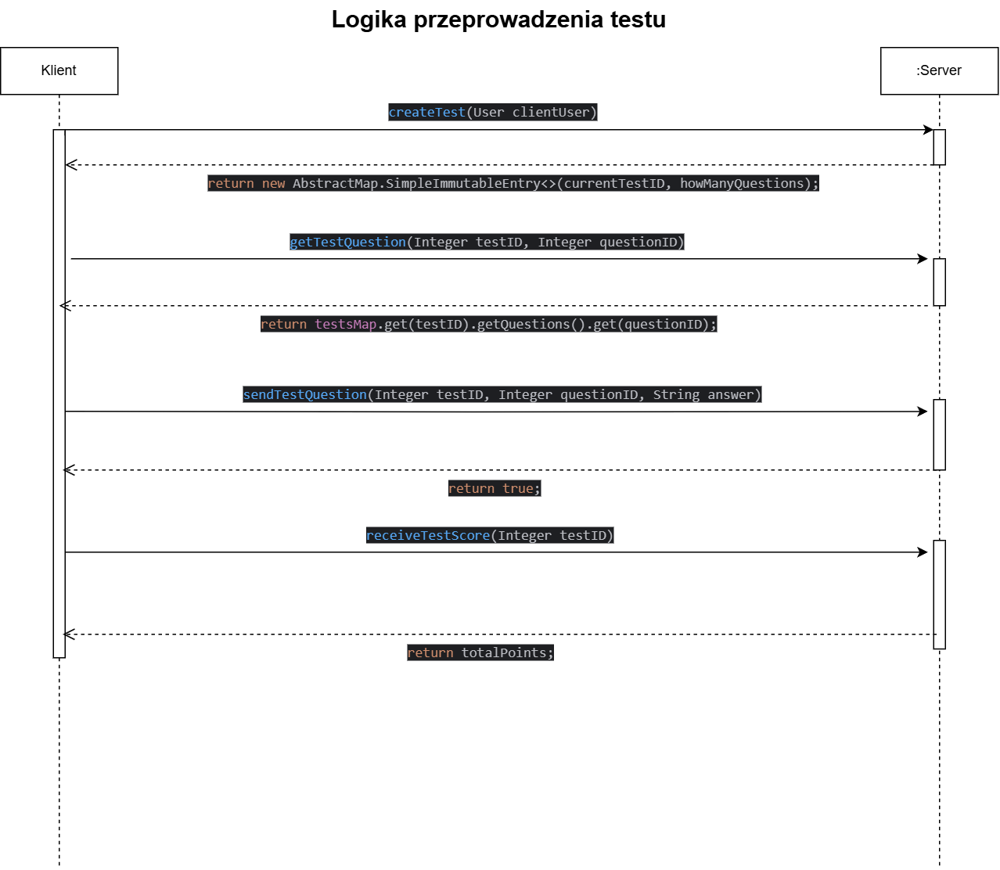

# Dokumentacja projektu pt. `RMI Testing App`
## Dane autorów i ich wkład w poszczególne części projektu.
1. Jakub Krać (serwer)
2. Filip Uliasz (klient)

Wspólnie: ustalenie API, przygotowanie i implementacja modułu `TestService`, przygotowanie dokumentacji.

## Krótki opis celu programu.
Celem projektu jest przygotowanie rozwiązania umożliwiającego zdalne przeprowadzanie zamkniętych testów jednokrotnego wyboru, a także podgląd wyników użytkowników i przechowywanie odpowiedzi. 

## Opis i schemat struktury logicznej aplikacji.

Przeprowadzenie testu polega na tym, że:
- Klient po zalogowaniu wybiera opcje rozpoczęcia testu.
- Po zaakceptowaniu, Klient otrzymuje od serwera parę <CurrentcurrentTestID, howManyQuestions>, a serwer po swojej stronie tworzy test, któremu przypisuje obiekt użytkownika oraz dodaje test do mapy <testID, test>. Ponadto serwer dodaje testID do listy testsID zamieszczonej u użytkownika.
## Informacje o wykorzystanych klasach niestandardowych.

## Opis specyficznych metod rozwiązania problemu, takich jak metoda wykorzystana do
rozwiązania konkretnego aspektu.

## Krótka instrukcja obsługi.
1. Zainstalować zależności Maven
2. Uruchomić `Server`
3. Uruchomić `Client`
4. Zarejestrować nowego użytkownika
5. Zalogować nowego użytkownika
6. Uruchomić nowy test: `Start Test!` > `Yes` > rozwiązać test. 
7. Podejrzeć wyniki: `Show results`. 
8. Wylogować użytkownika. 

## Ograniczenia programu, np. maksymalna liczba obsługiwanych klientów.
1. Podglądanie wyników jest możliwe jedynie dla tych testów, które zostały wykonane od czasu ostatniego restartu serwera. \
Nie jest możliwe poznanie (z perspektywy użytkownika) wyników testów wykonanych wcześniej, mimo, że rezultaty zapisują się do pliku na serwerze. 
2. System wyklucza możliwość zalogowania danego użytkownika z więcej niż jednej instancji aplikacji klienckiej. Oznacza to także, że niepoprawne 
wylogowanie (np. przez zamknięcie okna z aktywnym testem) spowoduje brak możliwości ponownego zalogowania się.

• Inne istotne informacje związane z tematem projektu