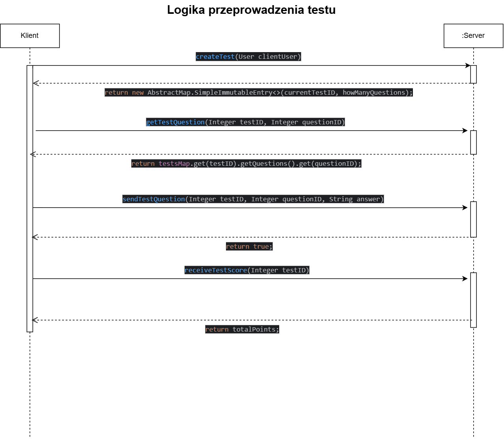

# Dokumentacja projektu pt. `RMI Testing App`
## 👨‍💻 Dane autorów i ich wkład w poszczególne części projektu.
1. Jakub Krać (serwer)
2. Filip Uliasz (klient)

Wspólnie: ustalenie API, przygotowanie i implementacja modułu `TestService`, przygotowanie dokumentacji.

## 📖 Krótki opis celu programu.
Celem projektu jest przygotowanie rozwiązania umożliwiającego zdalne przeprowadzanie zamkniętych testów jednokrotnego wyboru, a także podgląd wyników użytkowników i przechowywanie odpowiedzi. 

## 📖 Opis i schemat struktury logicznej aplikacji.

Przeprowadzenie testu polega na tym, że:
- Klient po zalogowaniu wybiera opcje rozpoczęcia testu.
- Po zaakceptowaniu, Klient wywołuję metodę `createTest(User clientUser)` po stronie serwera, która zwraca parę `<currentTestID, howManyQuestions>`. Serwer po swojej stronie tworzy test, któremu przypisuje obiekt użytkownika oraz dodaje test do mapy `<testID, test>`. Ponadto serwer dodaje `testID` do listy `testsID` zamieszczonej u użytkownika.
- Potem w pętli Klient wywołuje metodę `getTestQuestion(Integer testID, Integer questionID)` po stronie serwera, która zwraca odpowiednią kopię obiektu Klasy `Question`.
- Po otrzymaniu pytania i wybraniu odpowiedzi, Klient wywołuje metodę `sendTestQuestion(Integer testID, Integer questionID, String answer)`, która zwraca true. Serwer ustawia dla odpowiedniego testu i pytania odpowiedź.
- Po zakończeniu testu, Klient wywołuje metodę `receiveTestScore(Integer testID)`, która zwraca liczbę otrzymanych punktów. Serwer ustawia dla odpowiedniego testu datę oraz wynik.

## 📂 Informacje o wykorzystanych klasach niestandardowych.
Klasa `User` reprezentuje użytkownika, posiada pola takie jak:
- `private String name`;
- `private String email`;
- `private String password`;
- `private String firstName`;
- `private String surname`;
- `private boolean isLoggedIn`;
- `private List<Integer> testsID`;

Klasa `Test` posiada pola takie jak:
- `private User user`;
- `private int id`;
- `private List<Question> questions`;
- `private boolean testEnabled`;
- `private int testScore`;
- `private LocalDateTime date`;

Klasa `Question` reprezentuje pytanie. Posiada metodę `loadQuestions()`, która wczytuje odpowiednią ilość pytań z pliku zamieszczonego po stronie serwera i zwraca listę obiektów swojej klasy. Ponadto posiada pola takie jak:
- `private String question`;
- `private String answerA`;
- `private String answerB`;
- `private String answerC`;
- `private String correctAnswer`;
- `private String userAnswer`;
- `private int point`;

Klasa `Result` reprezentuje wynik testu, który wyświetlany jest w panelu Results Klienta. Posiada pola takie jak:
- `private int testId`;
- `private LocalDateTime sentAt`;
- `private int questionCount`;
- `private int correctAnswerCount`;
- `private double correctnessPercentage`;

Klasa `Server` posiada funkcje RMI takie jak:
- `User login(String username, String password) throws RemoteException` - służy do zalogowania użytkownika.
- `Pair<Boolean, String> register(String username, String password, String email, String firstName, String surname) throws RemoteException` - tworzy użytkownika po stronie serwera, dodając go do mapy;
- `boolean logout(String username) throws RemoteException` - służy do wylogowania użytkownia;
- `AbstractMap.SimpleImmutableEntry<Integer, Integer> createTest(User user) throws RemoteException` - tworzy test;
- `Integer receiveTestScore(Integer testID) throws RemoteException` - zwraca ilość punktów przesłanego `testID`;
- `Question getTestQuestion(Integer testID, Integer questionID) throws RemoteException` - zwraca odpowiednie pytanie;
- `boolean sendTestQuestion(Integer testID, Integer questionID, String answer) throws RemoteException` - wysyła pytanie do odpowiedniego testu;
- `List<Result> getUsersResults(String username) throws RemoteException` - zwraca listę rozwiązanych testów dla konkretnego użytkownika;

Z kolei pola klasy `Server` to:
- `private final String header;`
- `private final Map<String, User> usersMap;`
- `private final Console serverConsole;`
- `private final int notFound = -1;`
- `private final String questionsMainFilePath;`
- `private static int testID;`
- `private final Map<Integer, Test> testsMap;`

Klasa `Console` wykorzystywana jest po stronie Servera do wyświetlenia logów. Posiada tylko jedną metodę `void printLog(String header, String message)`.

Klasa `ClientMain` odpowiada za obsługę logiki aplikacji klienckiej. Przechowuje instancję klasy `Client`.

Klasa `Client` reprezentuje logikę działania aplikacji klienckiej. Przechowuje referencję do klasy `Server` oraz klasy `User`, które wykorzystuje w komunikacji z serwerem.

## 📖 Opis specyficznych metod rozwiązania problemu, takich jak metoda wykorzystana do rozwiązania konkretnego aspektu.
#### JavaFX
- Biblioteka do pisania prostych natywnych GUI (nie webowych)
- Wydana na licencji open-source
- Logika opiera się na renderowaniu widoków i przypisywaniu przyciskom akcji

#### 🛠️ Przechowywanie wyników testów na serwerze w formacie JSON-like. 
```
Test{
    id=0, 
    username=aaaa, 
    questions=[
        Question{
            question='Jak nazywa się stolica Polski?', 
            answerA='Warszawa', 
            answerB='Kraków', 
            answerC='Gdańsk', 
            correctAnswer='Warszawa', 
            userAnswer=Kraków, point=0
        }, Question{
            question='Ile wynosi pierwiastek kwadratowy z 64?', 
            answerA='8', 
            answerB='6', 
            answerC='7', 
            correctAnswer='8', 
            userAnswer=6, 
            point=0
            }{...} 
            testEnabled=true, 
            testScore=0
    }
```
    
## ⚙️ Krótka instrukcja obsługi.
1. Zainstalować zależności Maven
2. Uruchomić `Server`
3. Uruchomić `Client`
4. Zarejestrować nowego użytkownika
5. Zalogować nowego użytkownika
6. Uruchomić nowy test: `Start Test!` > `Yes` > rozwiązać test. 
7. Podejrzeć wyniki: `Show results`. 
8. Wylogować użytkownika. 

## 🛠️ Ograniczenia programu, np. maksymalna liczba obsługiwanych klientów.
1. System wyklucza możliwość zalogowania danego użytkownika z więcej niż jednej instancji aplikacji klienckiej. Oznacza to także, że niepoprawne 
wylogowanie (np. przez zamknięcie okna z aktywnym testem) spowoduje brak możliwości ponownego zalogowania się.
2. W ciągu dalszego rozwoju aplikacji należałoby:
- Dodać logikę generowania losowości pytań
- Wprowadzić obsługę limitu czasu na odpowiedź na pytanie po stronie klienta.

